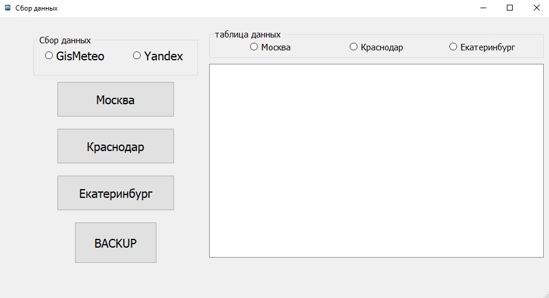
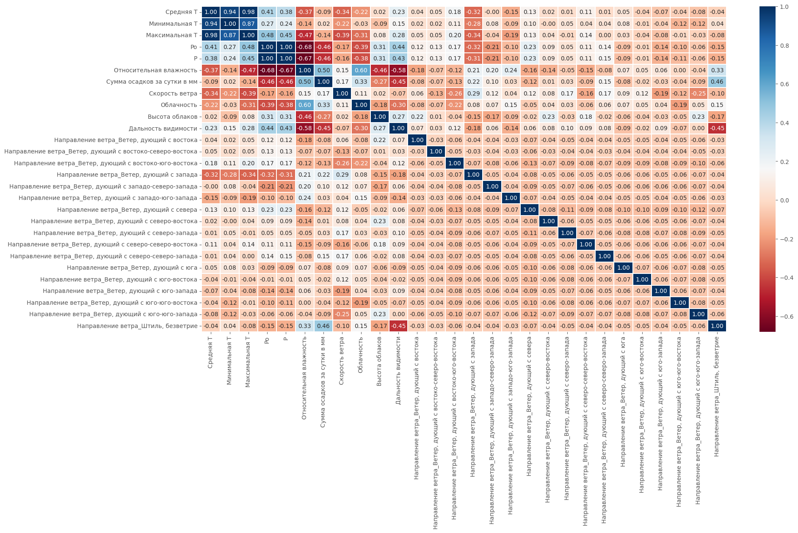

# [Telegram-bot с прогнозом погоды](https://t.me/Weather_Forecast_44_Bot)

## В данном репозитории реализован проект, который включает в себя:

 - ### Приложение, сделанное с помощью PyQt5, для сбора данных с сайтов: [Yandex](https://yandex.ru/pogoda?via=hl) и [GisMeteo](https://www.gismeteo.ru/). Позволяет собрать информацию о дневной температуре :sunny:, ночной температуре :crescent_moon: и прогнозе погоды :umbrella: на 10 дней вперед. В качестве примера используются 3 города: Москва, Краснодар и Екатеринбург:
 

  - ### [jupyter файл](https://github.com/badubidabambirimbum/weather-forecast-bot/blob/main/create_dataset/analitic_temp.ipynb) с формированием базы данных, анализом зависимостей и последующим отбором признаков для модели нейронной сети:

  - ### [telegram-bot]((https://t.me/Weather_Forecast_44_Bot)) :robot: , который предоставляет прогноз погоды (пока что позаимствованный у Яндекса):
  

  - ### Модель нейронной сети для построения прогноза погоды на 1, 3 или 10 дней вперед (находится в разработке)
