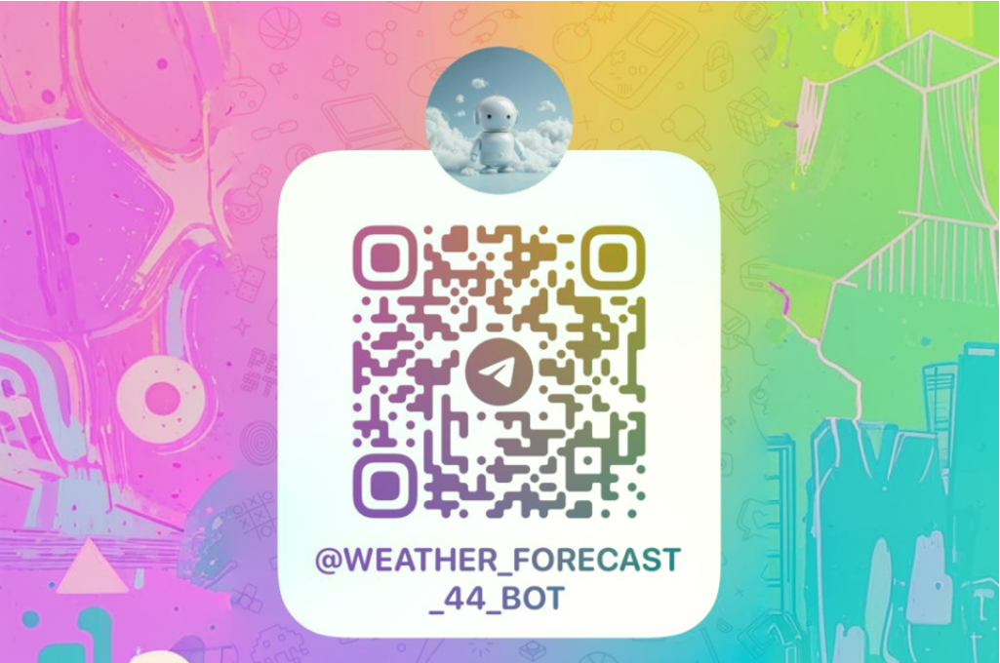

# Telegram-bot с прогнозом погоды
- В данном репозитории реализован класс, который позволяет собрать информацию о дневной температуре :sunny:, ночной температуре :crescent_moon: и прогнозе погоды :umbrella: на 10 дней вперед с сайтов: [Yandex](https://yandex.ru/pogoda?via=hl) и [GisMeteo](https://www.gismeteo.ru/).
 В качестве примера используются 3 города: Москва, Краснодар и Екатеринбург.
- Также реализован функционал телеграм-бота :robot: , который предоставляет прогноз погоды на 1 , 3 или 10 дней вперед:

